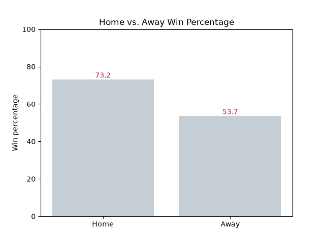
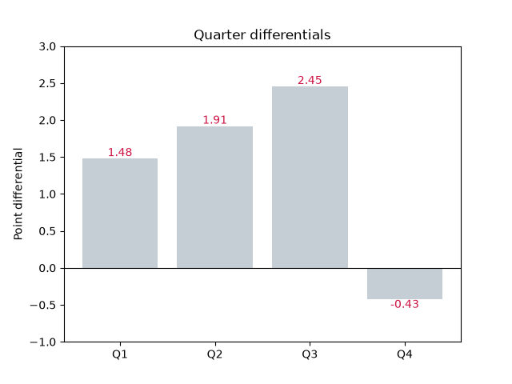
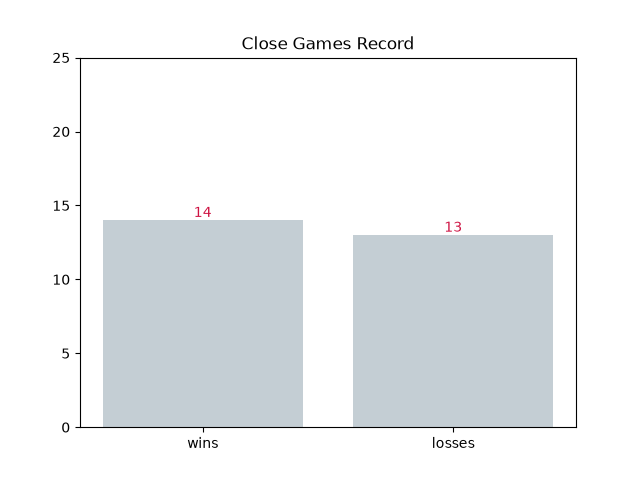
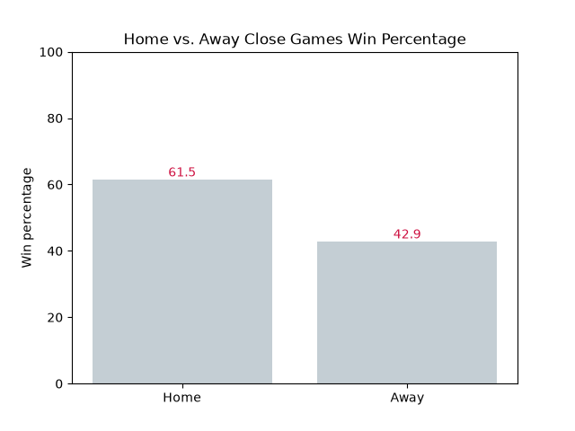

# 2025-26 Houston Rockets analytical data
Pulls data from nba api to get Houston's gamelogs 
## Key Findings
Key findings from this project included the Home vs Away win percentages, which were ~73% at home and ~54% away. 
I also gathered data on quarter trends and differentials throughout the season. Overall, throughout the season, 
the team usually has a lead in the first 3 quarters, with the differentials being 1.48, 1.91, and 2.45, but the fourth quarter is 
where things go downhill, with a differential of -0.43, meaning they are slightly outscored in the 4th quarter. 
I also retrieved data on close-game win percentage, which ended up being around .500. Deeper into that .500 record reveals that the team 
performs even better at home in close games winning 61.5% at home and 42.9% away showing the home-court advantage strengthens under pressure.




## Tech Stack

- Python
- pandas
- matplotlib
- nba_api

## Project Structure

```
data_pull.py # pulls data from NBA API, saves to CSV
analysis.py # loads csv, calculates key stats
Visualize.py # chart-making functions
data/ # saved csv and chart images
```

## How to run
1. pip install -r requirements.txt
2. python data_pull.py
3. python analysis.py